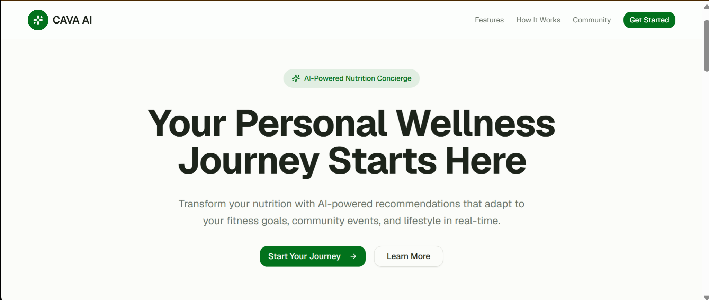
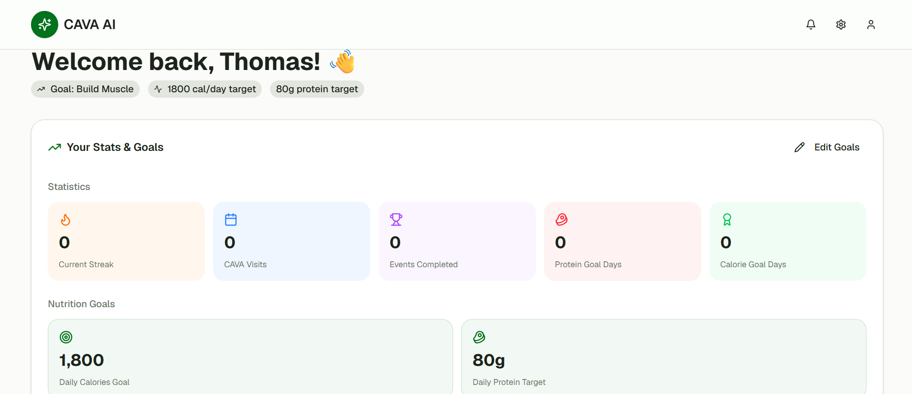
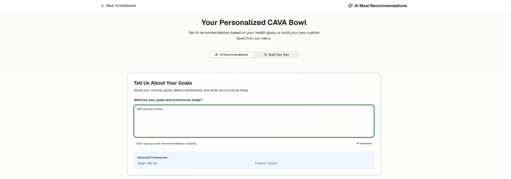

# CAVA AI Smart Nutrition Concierge

AI-powered personalized nutrition recommendation platform designed for CAVA.

This project combines:

* AI-powered meal recommendations
* Personalized wellness tracking
* Nutrition goal optimization
* Customer analytics
* Product strategy
* AI-assisted prototyping

---

## Product Vision

CAVA AI helps customers make healthier and more personalized food choices by integrating:

* fitness goals
* calorie targets
* protein preferences
* lifestyle behaviors
* community wellness activities

into a seamless AI-powered dining experience.

---

## Problem Statement

Many customers struggle to:

* choose meals that fit their nutrition goals
* balance taste and health preferences
* maintain healthy eating consistency
* personalize meals efficiently

This project explores how AI can improve the customer dining experience through intelligent recommendations and wellness-driven personalization.

---

## Key Features

* AI-powered meal recommendations
* Personalized calorie and protein targeting
* Smart ingredient recommendation engine
* User wellness dashboard
* Goal tracking system
* Community wellness integration
* Real-time recommendation updates

---

## Landing Page

---

## User Dashboard

---

## AI Recommendation Flow

---

## Recommendation Engine

---

## AI Recommendation Logic

The recommendation engine analyzes:

* calorie targets
* protein goals
* dietary preferences
* ingredient selections
* wellness objectives

to generate personalized CAVA bowl recommendations.

---

## Business Impact

This concept demonstrates how AI can help CAVA:

* improve customer personalization
* increase user engagement
* support healthier dining decisions
* strengthen customer retention
* create wellness-focused brand differentiation

---

## Tools & Technologies

* v0 by Vercel
* AI-assisted prototyping
* Product strategy
* Customer analytics
* UX/UI concept design

---

## AI-Assisted Development

The prototype UI was created using AI-assisted prototyping tools (v0) and refined as part of the product strategy, customer experience design, and business analytics process.

---

## Author

Po An Tao
M.S. Business Analytics
George Washington University
